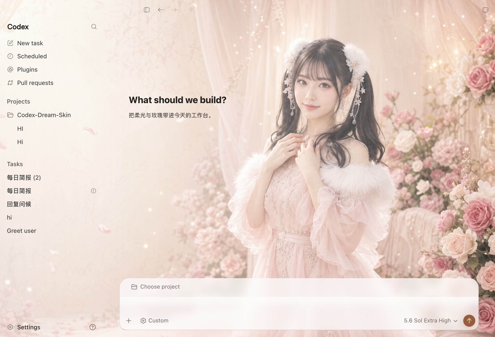
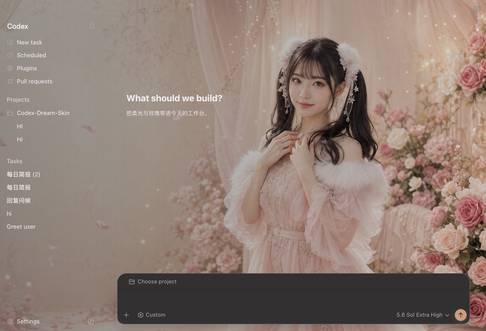
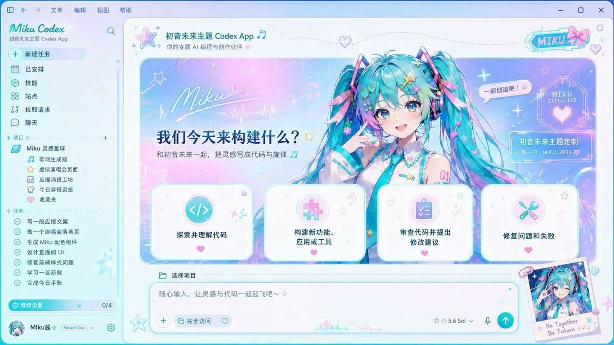

# Codex Dream Skin

  <a href="./README.md">中文</a> · <strong>English</strong>

  <strong>Give Codex a face that breathes.</strong> 
  External themes for the Codex desktop app · Local CDP inject · No official package mutation

  One image, one mood · Code with atmosphere

  Unofficial. Does not modify <code>.app</code> / <code>app.asar</code> / WindowsApps.

## Sponsors

  

  <strong>Smarter Connections · Passionate Creation</strong> 
  Connect AI · Power Creation

  Thanks to <a href="https://passion8.cc/register?aff=TuPe"><strong>passion8.cc</strong></a> for sponsoring this project. 
  Full-power AI gateway: official models, no silent downgrades, no wrapper shells. 
  One-line setup for Codex / Claude Code / Grok.

  
    Theme install and API config stay separate — this project never rewrites your provider settings.
  

## Tested featured preset: Arina Hashimoto

“Arina Hashimoto / 桥本有菜” has been verified on the real Codex home screen in
both light and dark appearances. The user-provided source PNG is `1672 × 941`;
the preset's `2560 × 1440` JPEG is a standardized derived export that preserves
the source's near-16:9 composition and does not add source detail. The sidebar,
cards, project picker, and composer
shown below are native Codex controls.

   
  Light · real injected screenshot; unsent input hidden during capture (preview only)

   
  Dark · real injected screenshot; unsent input hidden during capture (preview only)

Studio seeds the Arina Hashimoto preset on first install. Switch themes or import
your own UI-free wallpaper from Studio after verified success.

> The downloadable user source is [`docs/images/presets/romantic-rose-source.png`](./docs/images/presets/romantic-rose-source.png) (`1672 × 941`); the macOS one-click preset uses the normalized derived [`background.jpg`](./macos/presets/preset-romantic-rose/background.jpg) (`2560 × 1440`). Do not import either screenshot above: they contain real UI and are previews only. The background is a user-provided AI-generated example, not an official OpenAI/Codex visual or endorsement; confirm likeness and asset rights before redistributing it.

## Concept gallery (not importable backgrounds)

These eight images communicate achievable visual directions, but they are
interface mockups rather than usable theme backgrounds. Generate a UI-free
`2560 × 1440` image with the copy-ready [reference prompt guide](./docs/reference-background-prompt-guide.en.md)
before importing a similar look. See the [concept prompt breakdown](./docs/background-generation-prompts.md)
for the eight individual styles.

   
  Pink Custom

   
  God of Wealth

   
  Red-White Sci-Fi

   
  Clear Custom

   
  Inspiration

   
  Purple Night

   
  Cyan Virtual Singer

   
  Stage Black-Gold

## What it does

- **Real UI** — Sidebar, cards, project picker, and input stay native. Not a fake full-window screenshot.
- **Continuous wallpaper** — One 16:9 image spans the full window; adaptive focus, safe-area, and route treatment keep native content readable.
- **Swappable art** — Drop in a UI-free image you like and it becomes your theme.
- **Saved themes** — Switch local themes from the macOS menu bar or Windows system tray.
- **Restorable** — One-click restore to the stock look.
- **Safer path** — Local-loopback CDP inject only. No official binary or signature changes.

## Quick start

1. Download the signed Studio artifact for your platform, then open or install it.
2. Complete preflight and authorize one Codex restart only when Studio asks.
3. Wait for strict verified success. Use **Pause** for reversible soft-off and
   **Complete Restore** to remove the live skin and close managed CDP.

Ordinary macOS use needs no Terminal, SwiftBar, Homebrew, or separate Node.
Ordinary Windows use needs no PowerShell, PATH Node, administrator elevation, or manual commands.

| Platform | Studio artifact | Advanced recovery |
|------|------|------|
| Apple Silicon / Intel Mac | `CodexDreamSkinStudio.dmg` | [`macos/README.md`](./macos/README.md) |
| Windows | `CodexDreamSkinStudio-Setup.exe` | [`windows/SKILL.md`](./windows/SKILL.md) |

### Advanced recovery

Repository shell launchers, SwiftBar, PowerShell scripts, diagnostics, and manual
restore commands remain supported maintainer/recovery paths, not the normal install story.

Milestone 1 does not include theme-package sharing, workspace scenes/bindings,
context profiles, or motion/video.

This repository also includes four [optional user themes](./user-themes/) that are not installed automatically: `IU Ivory Bridal`, `Gojo Satoru`, `Sakura Spring Festival`, and `Yuzuriha Inori`.

More detail:

- Mac: [`macos/README.md`](./macos/README.md)
- Windows: [`windows/SKILL.md`](./windows/SKILL.md)
- Paths: [`docs/platforms.md`](./docs/platforms.md)
- Copy-ready reference prompt guide: [`docs/reference-background-prompt-guide.en.md`](./docs/reference-background-prompt-guide.en.md)
- Eight concept prompt breakdowns: [`docs/background-generation-prompts.md`](./docs/background-generation-prompts.md)
- Project notes: [`docs/PROJECT.md`](./docs/PROJECT.md)

## Feedback & contributions

- **Issues:** Use the [issue templates](./.github/ISSUE_TEMPLATE/) (bug / feature). Blank issues are disabled. Please try Verify / Restore self-checks before filing bugs.
- **PRs:** Follow the [PR template](./.github/pull_request_template.md) — describe the change and tick the self-checks you actually ran (e.g. `macos/tests/run-tests.sh`, verify / restore).

## Safety

- CDP binds `127.0.0.1` only — avoid untrusted local processes while the theme runs.
- Does not touch the official install directory or code signature.
- **Never** rewrites API Key / Base URL; relay and theme stay separate.

## License

- See [`macos/LICENSE`](./macos/LICENSE) (MIT) and [`macos/NOTICE.md`](./macos/NOTICE.md)
- Unofficial; Codex and related rights belong to their owners.
- People / IP material in bundled presets and previews is illustrative only — clear likeness, asset, and trademark rights before commercial redistribution.

---

Star it, pick a look, and make Codex yours for today.
